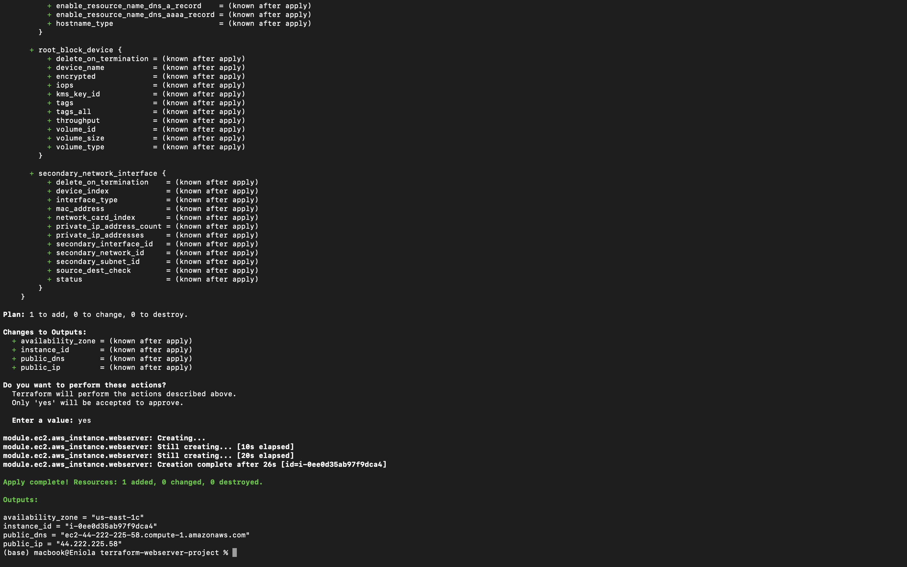
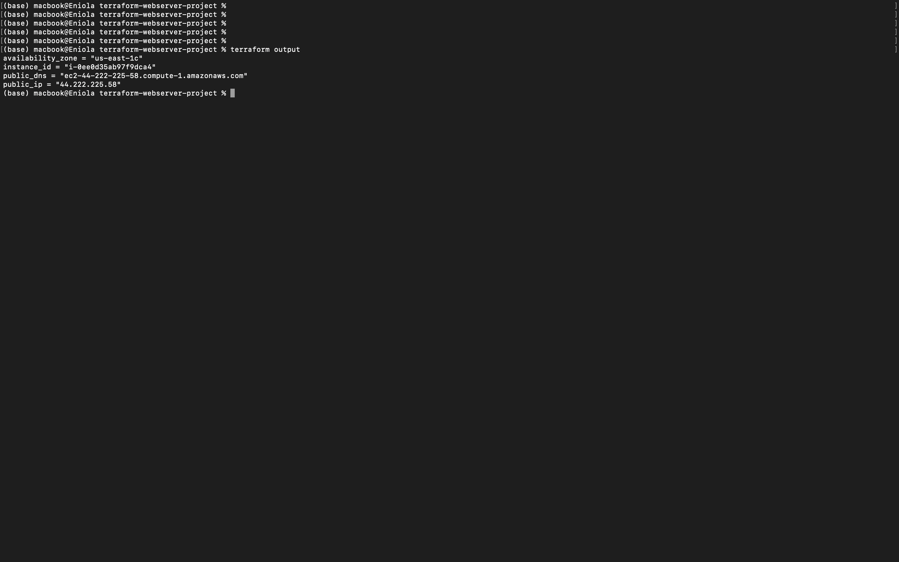
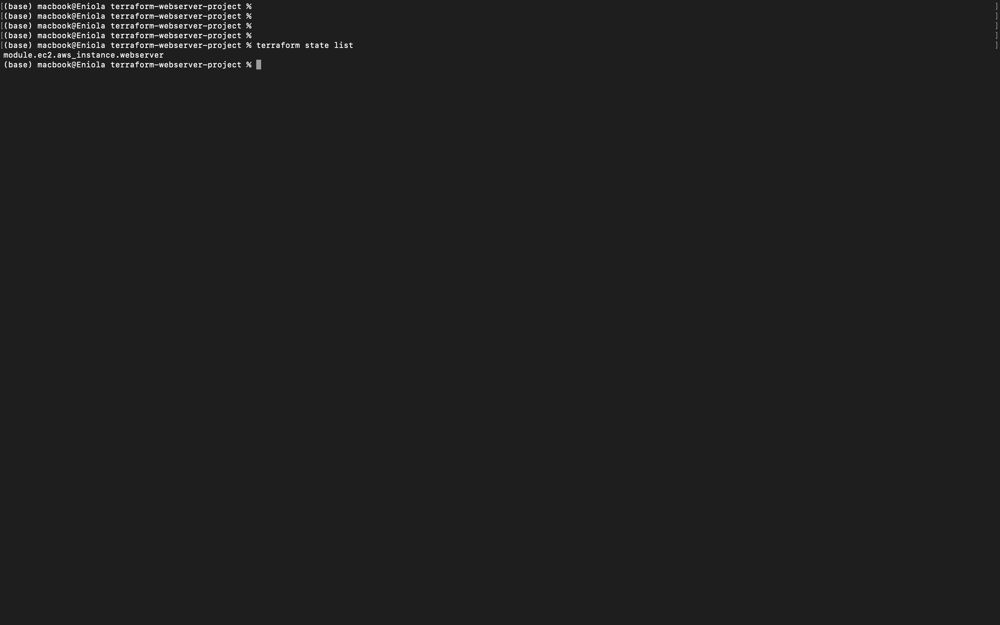
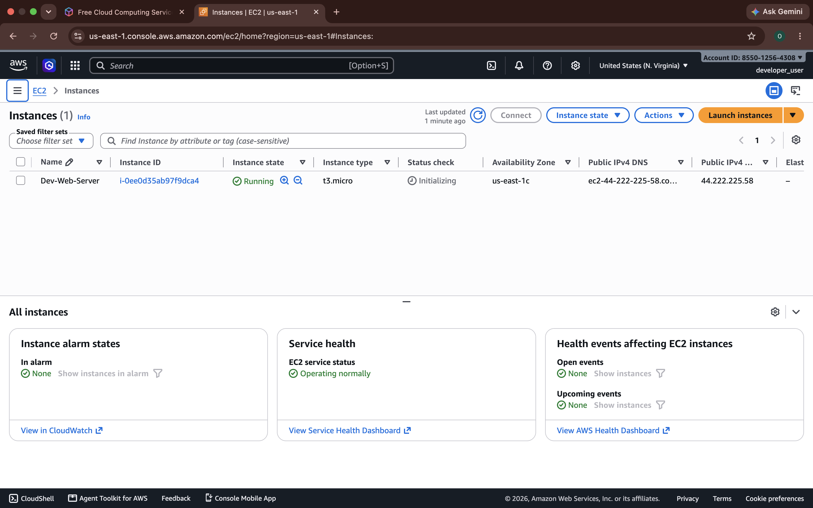
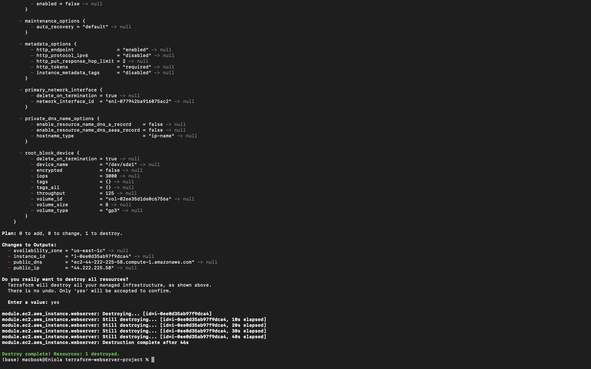

# Terraform AWS EC2 Webserver Project

## Project Overview

This project demonstrates the provisioning of a highly configurable AWS EC2 web server infrastructure using Terraform.

The infrastructure was built using Terraform best practices, including:

- Terraform variables for reusable configuration
- Terraform modules for infrastructure organization
- Terraform outputs for retrieving deployed resource information
- AWS provider configuration
- Infrastructure deployment using Terraform CLI commands

The goal of this project was to move away from manually creating AWS resources through the AWS Management Console and instead manage cloud infrastructure using Infrastructure as Code (IaC).

---

# Project Objectives

The objectives of this project were to:

- Configure Terraform to communicate with AWS using the HashiCorp AWS provider
- Create a reusable EC2 module
- Provision an AWS EC2 instance using Terraform
- Use variables to make the infrastructure configurable
- Use outputs to display important EC2 information after deployment
- Organize Terraform files using a professional project structure
- Demonstrate Terraform lifecycle commands
- Manage the project using GitHub

---

# Technologies Used

| Technology | Purpose |
|------------|---------|
| Terraform | Infrastructure as Code tool used to provision and manage AWS resources |
| AWS EC2 | Virtual server infrastructure |
| AWS Provider | Terraform plugin used to communicate with AWS |
| HCL | Configuration language used to write Terraform code |
| GitHub | Version control and project repository management |

---

# Project Architecture

The project follows a modular Terraform architecture where the root module manages configuration and calls a reusable EC2 child module.

```text
terraform-aws-ec2-webserver
│
├── provider.tf
│   └── Configures AWS provider and Terraform version requirements
│
├── variables.tf
│   └── Defines reusable input variables
│
├── terraform.tfvars
│   └── Stores environment-specific variable values
│
├── main.tf
│   └── Calls the EC2 module and passes required values
│
├── outputs.tf
│   └── Displays EC2 information after deployment
│
├── .gitignore
│   └── Prevents sensitive Terraform files from being uploaded
│
└── modules
    │
    └── ec2
        │
        ├── main.tf
        │   └── Creates the AWS EC2 instance
        │
        ├── variables.tf
        │   └── Defines module input variables
        │
        └── outputs.tf
            └── Returns EC2 resource information

---

# Terraform Deployment Flow

```text
terraform.tfvars
        |
        |
        v
variables.tf
        |
        |
        v
Root main.tf
        |
        |
        v
EC2 Module
        |
        |
        v
AWS EC2 Instance
        |
        |
        v
Module Outputs
        |
        |
        v
Root Outputs
        |
        |
        v
terraform output command
```
---

# AWS Infrastructure Created

The Terraform configuration provisions the following AWS resource:

| Resource | Description |
|----------|-------------|
| AWS EC2 Instance | Development web server instance provisioned through a reusable Terraform module |

The EC2 instance is configured with:

- Ubuntu Amazon Machine Image (AMI)
- Configurable EC2 instance type
- Existing AWS Key Pair for SSH access
- Custom resource tags

## EC2 Instance Tags

| Tag | Value |
|-----|-------|
| Name | Dev-Web-Server |
| Environment | Development |
| Owner | Eniola |

---

# Section 2 — Terraform Project Setup and AWS Provider Configuration

## Project Initialization

The first step was to create the Terraform project directory and organize the files according to Terraform best practices.

The project was named:

```text
terraform-aws-ec2-webserver
```

The initial project structure was created as follows:
```text
terraform-aws-ec2-webserver
│
├── provider.tf
├── variables.tf
├── terraform.tfvars
├── main.tf
├── outputs.tf
│
└── modules
    └── ec2
        ├── main.tf
        ├── variables.tf
        └── outputs.tf
```

---

# Creating the Terraform Configuration Files

The following Terraform configuration files were created to organize the project according to Terraform best practices:

| File | Purpose |
|------|---------|
| `provider.tf` | Configures Terraform requirements and AWS provider settings |
| `variables.tf` | Defines reusable input variables used throughout the project |
| `terraform.tfvars` | Stores values assigned to Terraform variables |
| `main.tf` | Calls the EC2 module and manages infrastructure deployment |
| `outputs.tf` | Displays information returned after infrastructure deployment |

A local EC2 module was also created to separate reusable EC2 infrastructure logic from the root Terraform configuration.

The module structure:

```text
modules/
└── ec2/
    ├── main.tf
    ├── variables.tf
    └── outputs.tf
```
| Module File                | Purpose                                         |
| -------------------------- | ----------------------------------------------- |
| `modules/ec2/main.tf`      | Contains the EC2 resource configuration         |
| `modules/ec2/variables.tf` | Defines variables required by the EC2 module    |
| `modules/ec2/outputs.tf`   | Returns EC2 information back to the root module |

The EC2 module was created to separate reusable EC2 infrastructure logic from the root Terraform configuration.

---

# Configuring the AWS Provider

Terraform requires a provider plugin to communicate with cloud platforms.

For this project, the HashiCorp AWS provider was configured.

The provider configuration was added to provider.tf
```hcl
terraform {

  required_providers {

    aws = {
      source  = "hashicorp/aws"
      version = "~> 6.0"
    }

  }

}

provider "aws" {

  region = var.aws_region

}
```
## AWS Provider Block
```hcl 
provider "aws" {

  region = var.aws_region

}
```
The AWS provider block configures how Terraform connects to AWS.

The region was configured using a variable instead of hardcoding the value.

The region value is stored in:
```text
terraform.tfvars
```
Example:
```hcl
aws_region = "us-east-1"
```
This allows the same Terraform configuration to be reused in different AWS regions by changing only the variable value.

## Initializing Terraform

After configuring the provider, Terraform was initialized using:
```bash
terraform init
```
The initialization process:

- Downloads the required AWS provider plugin
- Initializes the Terraform working directory
- Prepares the project for Terraform commands

Expected output:
```text
Terraform has been successfully initialized!
```

## Validating Terraform Configuration

The Terraform configuration was validated using:
```bash
terraform validate
```
Validation checks:

- Terraform syntax
- Resource configuration
- Variable references
- Module configuration

Expected output:
```text
Success! The configuration is valid.
```
---

# Section 3 — Creating and Configuring Terraform Variables

## Introduction

To make the Terraform configuration reusable and flexible, variables were used instead of hardcoding values directly into the Terraform files.

Variables allow different values to be provided without modifying the infrastructure code.

For example:

- The AWS region can be changed without editing `provider.tf`
- The EC2 instance type can be changed without editing the EC2 module
- Different AMIs can be used for different environments

The variable flow used in this project:

```text
terraform.tfvars
        |
        |
        v
variables.tf
        |
        |
        v
Terraform Configuration
        |
        |
        v
AWS Resources
```
# Creating Root Module Variables

The required variables were declared in the root variables.tf file.

The variables created were:

| Variable        | Purpose                                     | Type   |
| --------------- | ------------------------------------------- | ------ |
| `aws_region`    | AWS region where resources will be deployed | string |
| `instance_name` | Name assigned to the EC2 instance           | string |
| `instance_type` | EC2 instance size/type                      | string |
| `ami_id`        | AMI ID used to launch the EC2 instance      | string |
| `key_name`      | Existing AWS Key Pair used for SSH access   | string |
| `environment`   | Deployment environment tag                  | string |
| `owner`         | Resource owner tag                          | string |

## Variable Configuration

The variables were configured using three main attributes:

| Attribute     | Purpose                                           |
| ------------- | ------------------------------------------------- |
| `description` | Explains the purpose of the variable              |
| `type`        | Defines the expected data type                    |
| `default`     | Provides a fallback value if no value is supplied |

Example variable configuration:
```hcl
variable "instance_type" {

  description = "EC2 instance type"

  type = string

}
```

## Assigning Variable Values Using terraform.tfvars

The actual values were stored separately in the terraform.tfvars file.

This keeps configuration values separate from Terraform logic.

Example:
```hcl
aws_region = "us-east-1"

instance_name = "Dev-Web-Server"

instance_type = "t3.micro"

ami_id = "ami-052355af2a014bd2c"

key_name = "terraform-webserver-key"

environment = "Development"

owner = "Eniola"
```
---

## Why terraform.tfvars Was Used

Using terraform.tfvars provides several advantages:

- Keeps Terraform code reusable
- Allows different environments to use different values
- Prevents frequent modification of Terraform files
- Makes infrastructure easier to maintain

Example:

Development environment:
```hcl
instance_type = "t3.micro"
```

Production environment:
```hcl
instance_type = "t3.large"
```
The Terraform configuration remains unchanged.

---

# Section 4 — Creating the EC2 Terraform Module

## Introduction

Terraform modules allow infrastructure code to be organized into reusable components.

Instead of placing all resources inside one large `main.tf` file, the EC2 infrastructure was separated into its own local module.

The module created for this project:

```text
modules/ec2
```
The purpose of the module is to create and configure an AWS EC2 instance using values passed from the root Terraform configuration.

---

# Module Architecture

The Terraform module structure:
```text
terraform-aws-ec2-webserver
│
├── main.tf
│
└── modules
    └── ec2
        │
        ├── main.tf
        ├── variables.tf
        └── outputs.tf
```
---

## EC2 Module Files

| File                       | Purpose                                              |
| -------------------------- | ---------------------------------------------------- |
| `modules/ec2/main.tf`      | Contains the AWS EC2 instance resource configuration |
| `modules/ec2/variables.tf` | Defines inputs required by the EC2 module            |
| `modules/ec2/outputs.tf`   | Returns EC2 information to the root module           |

---

## Creating Module Variables

The EC2 module receives the following inputs from the root module:

| Variable        | Purpose                                                        |
| --------------- | -------------------------------------------------------------- |
| `ami_id`        | Specifies the Amazon Machine Image used to create the instance |
| `instance_type` | Defines the EC2 instance size                                  |
| `key_name`      | Specifies the AWS Key Pair used for SSH access                 |
| `instance_name` | Defines the EC2 Name tag                                       |
| `environment`   | Defines the deployment environment tag                         |
| `owner`         | Defines the resource owner tag                                 |

---

## EC2 Module Resource Configuration

The EC2 instance was created inside:
```text
modules/ec2/main.tf
```
Configuration:
```hcl
resource "aws_instance" "webserver" {

  ami = var.ami_id

  instance_type = var.instance_type

  key_name = var.key_name


  tags = {

    Name = var.instance_name

    Environment = var.environment

    Owner = var.owner

  }

}
```

---

# Understanding the EC2 Resource Configuration

## Resource Declaration
```hcl
resource "aws_instance" "webserver"
```
This tells Terraform to create an AWS EC2 instance.

The first value:
```text
aws_instance
```
represents the AWS resource type.

The second value:
```text
webserver
```
is Terraform's internal name used to reference the resource.

---

## AMI Configuration
```hcl
ami = var.ami_id
```
The AMI defines the operating system image used to launch the EC2 instance.

For this project:

- Ubuntu 24.04 LTS AMI was used
- The AMI ID was provided through terraform.tfvars

Example- in the terraform.tfvars file:
```hcl
ami_id = "ami-052355af2a014bd2c"
```
---

## Instance Type Configuration
```hcl
instance_type = var.instance_type
```
The instance type determines the compute resources allocated to the EC2 instance.

For this project- in the terraform.tfvars file:
```hcl
instance_type = "t3.micro"
```
The t3.micro instance type was selected because it is suitable for development and testing environments.

---

## Key Pair Configuration
```hcl
key_name = var.key_name
```

The key pair allows secure SSH access to the EC2 instance.

The key pair was created separately in AWS and passed into Terraform as a variable.

Example:
```hcl
key_name = "terraform-webserver-key"
```

---

## Resource Tagging

The EC2 instance was tagged with:

| Tag         | Purpose                              |
| ----------- | ------------------------------------ |
| Name        | Identifies the EC2 instance          |
| Environment | Specifies the deployment environment |
| Owner       | Identifies the resource owner        |

Example:
```hcl
tags = {

  Name = "Dev-Web-Server"

  Environment = "Development"

  Owner = "YourName"

}
```

---

# Section 5 — Connecting the EC2 Module to the Root Terraform Configuration

## Introduction

After creating the EC2 module, the next step was to connect it to the root Terraform configuration.

The root module is responsible for:

- Providing input values
- Calling the EC2 module
- Managing the overall Terraform deployment

The EC2 module is responsible for:

- Creating the AWS EC2 instance
- Applying the required configuration
- Returning resource information through outputs

---

# Root Module and Child Module Relationship

The project follows a parent-child module structure:

```text
Root Module
│
├── provider.tf
│       |
│       └── Configures AWS Provider
│
├── variables.tf
│       |
│       └── Defines project variables
│
├── terraform.tfvars
│       |
│       └── Provides variable values
│
├── main.tf
│       |
│       └── Calls EC2 Module
│
└── modules/ec2
        |
        ├── Creates EC2 Instance
        └── Returns Outputs
```

---

# Calling the EC2 Module

The EC2 module was called from the root main.tf file.

Configuration:
```hcl
module "ec2" {

  source = "./modules/ec2"


  ami_id = var.ami_id

  instance_type = var.instance_type

  key_name = var.key_name

  instance_name = var.instance_name

  environment = var.environment

  owner = var.owner

}
```

---

# Understanding the Module Configuration

## Module Name
```hcl
module "ec2"
```

This creates a module block named ec2.

This name is used by Terraform to reference resources created inside the module.

---

## Module Source
```hcl
source = "./modules/ec2"
```

This tells Terraform where to find the module code.

In this project, the EC2 module is stored locally inside:
```text
modules/ec2
```

---

## Passing Variables to the Module

The root module passes values from terraform.tfvars into the EC2 module.

Example:
```hcl
ami_id = var.ami_id
```

The value flow:
```text
terraform.tfvars
        |
        |
        v
Root variables.tf
        |
        |
        v
main.tf
        |
        |
        v
modules/ec2/variables.tf
        |
        |
        v
modules/ec2/main.tf
```

---

# Creating Root Outputs

The EC2 module contains outputs, but those outputs need to be exposed through the root module.

The root outputs.tf file was configured to retrieve information from the EC2 module.

Example:
```hcl
output "instance_id" {

  description = "EC2 Instance ID"

  value = module.ec2.instance_id

}
```

---

## Output Flow

The output process follows this structure:
```text
AWS EC2 Instance
        |
        |
        v
modules/ec2/outputs.tf
        |
        |
        v
root outputs.tf
        |
        |
        v
terraform output command
```

---

## Available Terraform Outputs

After deployment, Terraform displays the following information:

| Output              | Description                                           |
| ------------------- | ----------------------------------------------------- |
| `instance_id`       | Unique ID assigned to the EC2 instance                |
| `public_ip`         | Public IPv4 address of the EC2 instance               |
| `public_dns`        | Public DNS hostname of the EC2 instance               |
| `availability_zone` | AWS Availability Zone where the instance was deployed |

---

# Section 6 — Terraform Deployment Process

## Introduction

After completing the Terraform configuration, variables, and EC2 module setup, the infrastructure was deployed using Terraform CLI commands.

Terraform follows a workflow that allows infrastructure to be formatted, validated, planned, deployed, inspected, and destroyed.

---

# Terraform Workflow

```text
Terraform Configuration Files
            |
            v
      terraform fmt
            |
            v
     terraform validate
            |
            v
       terraform plan
            |
            v
       terraform apply
            |
            v
     AWS EC2 Instance Created
            |
            v
     terraform output/show
            |
            v
    terraform destroy

```

---

# Formatting Terraform Files

The first command used was:
```bash
terraform fmt
```

Purpose:

- Formats Terraform files according to standard HCL formatting rules
- Improves readability
- Ensures consistent code structure

Example output:
```text
main.tf
provider.tf
variables.tf
outputs.tf
```

---

# Initializing Terraform

Command:
```bash
terraform init
```

Purpose:

Downloads required Terraform providers
Initializes modules
Prepares the project for deployment

The AWS provider was downloaded from:
```text
registry.terraform.io/hashicorp/aws
```

---

# Validating Terraform Configuration

Command:
```bash
terraform validate
```

Purpose:

- Checks Terraform syntax
- Confirms resource configuration is valid
- Detects configuration errors before deployment

Successful validation:
```text
Success! The configuration is valid.
```

---

# Creating an Execution Plan

Command:
```bash
terraform plan
```

Purpose:

- Shows the actions Terraform will perform
- Displays resources that will be created, modified, or destroyed
- Allows changes to be reviewed before applying

Expected result:
```text
Plan: 1 to add, 0 to change, 0 to destroy.
```

---

# Deploying the EC2 Instance

Command:
```bash
terraform apply
```

Terraform requested confirmation before creating the infrastructure.

Confirmation:
```text
Do you want to perform these actions?
Only 'yes' will be accepted to approve.
```

The deployment was approved by entering:
```text
yes
```

Successful deployment:
```text
Apply complete! Resources: 1 added, 0 changed, 0 destroyed.
```

## Terraform Apply Result Screenshot Evidence



---

# Viewing Terraform Outputs

Command:
```bash
terraform output
```

The command displayed the information returned by the EC2 module:

- EC2 Instance ID
- Public IP Address
- Public DNS
- Availability Zone

Example:
```text
instance_id = "i-xxxxxxxxxxxxxxxxx"

public_ip = "xx.xx.xx.xx"

public_dns = "ec2-xx-xx-xx.compute.amazonaws.com"

availability_zone = "us-east-1a"
```

## Terraform Output Result Screenshot Evidence



---

# Checking Terraform State

Command:
```bash
terraform state list
```

Purpose:

- Displays resources currently managed by Terraform
- Confirms Terraform is tracking deployed infrastructure

Example output:
```text
module.ec2.aws_instance.webserver
```

## Terraform State List Screenshot Evidence



---

# Section 7 — AWS Verification, Terraform Destroy, and GitHub Repository

## AWS Console Verification

After successfully deploying the infrastructure using Terraform, the created EC2 instance was verified through the AWS Management Console.

The EC2 instance was checked to confirm:

- Instance status was running
- Correct instance type was deployed
- Correct Availability Zone was assigned
- Required tags were applied
- Correct AMI was used

---

# EC2 Instance Details

The deployed EC2 instance contained the following configuration:

| Configuration | Value |
|--------------|-------|
| Resource Type | AWS EC2 Instance |
| Operating System | Ubuntu |
| Instance Type | t3.micro |
| Region | us-east-1 |
| Environment | Development |

---

# EC2 Instance Tags

The following tags were applied to the EC2 instance:

| Tag | Value |
|-----|-------|
| Name | Dev-Web-Server |
| Environment | Development |
| Owner | YourName |

---

# AWS EC2 Console Screenshot Evidence



---

# Terraform Destroy

Terraform was also used to demonstrate infrastructure cleanup.

The command used:

```bash
terraform destroy
```

Purpose:

- Removes resources created by Terraform
- Updates Terraform state
- Demonstrates complete infrastructure lifecycle management

Terraform requested confirmation:
```text
Do you really want to destroy all resources?
Only 'yes' will be accepted to approve.
```

The destruction was approved by entering:
```text
yes
```

Successful destruction output:
```text
Destroy complete! Resources: 1 destroyed.
```

# Terraform Destroy Result Screenshot Evidence



---

# Project Completion Summary

This project successfully demonstrated the use of Terraform to provision reusable AWS infrastructure.

Key skills demonstrated:

- Terraform provider configuration
- Terraform variables
- Terraform modules
- Terraform outputs
- AWS EC2 provisioning
- Infrastructure lifecycle management
- GitHub project organization

The final infrastructure was created, verified, and destroyed successfully using Terraform CLI commands.


